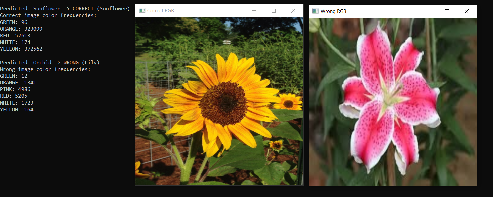

# Flower Recognition Project 
## Table of Contents

1. [Introduction](#introduction)
2. [Project Overview](#project-overview)
   1. [Handling the dataset](#1-handling-the-dataset)
   2. [Result Computation and Presentation](#2-result-computation-and-presentation)
   3. [Classification Methods](#3-classification-methods)
3. [Prerequisites](#prerequisites)
   1. [Software](#software)
   2. [Hardware](#hardware)
4. [Set up and Troubleshooting](#set-up-and-troubleshooting)
5. [User Guide and Options Description](#user-guide-and-options-description)
6. [Project Structure](#project-structure)
   1. [OpenCVApplication.cpp](#opencvapplicationcpp)
   2. [Tag.hpp](#taghpp)
   3. [Tag.cpp](#tagcpp)
7. [Conclusions](#conclusions)
7. [Demonstration](#demonstration)

## Introduction

&nbsp; &nbsp;&nbsp; &nbsp;This project aims to correctly classify the photos of the dataset: [5 Flower Types Classification Dataset](https://www.kaggle.com/datasets/kausthubkannan/5-flower-types-classification-dataset), using OpenCV for image processing. The dataset contains 5 types of flowers, each having 1000 photos. The included flower classes are: Sunflower, Tulip, Orchid, Lily, and Lotus.\

&nbsp; &nbsp;&nbsp; &nbsp;OpenCV (Open Source Computer Vision Library) is an open-source computer vision and machine learning software library. OpenCV was built to provide a common infrastructure for computer vision applications and to accelerate the use of machine perception in commercial products. Being a BSD-licensed product, OpenCV makes it easy for businesses to utilize and modify the code. The library contains more than 2500 optimized algorithms, which can be used for a variety of tasks including facial recognition, object identification, and in this case, flower classification.\

&nbsp; &nbsp;&nbsp; &nbsp;OpenCV's robust image processing capabilities make it ideal for this project. It provides tools to read and write images, transform them, and perform complex operations on them with ease. The library supports a range of image processing operations such as filtering, edge detection, corner detection, and object tracking. Additionally, it offers machine learning algorithms to train and predict data, which is critical for the classification task at hand.

&nbsp; &nbsp;&nbsp; &nbsp;In this project, OpenCV is used to preprocess the images and extract features that are essential for the classification algorithms. The preprocessing steps include resizing, color space conversion, and filtering to enhance the quality of the images and highlight important features. The classification methods leverage these processed images to accurately identify the type of flower in each photo.\

&nbsp; &nbsp;&nbsp; &nbsp;The aim of this project is to develop a reliable and efficient classification system for the five types of flowers in the dataset. By harnessing the power of OpenCV's image processing functions, we can build a model that not only achieves high accuracy but also provides insights into the distinguishing features of each flower type.

## Project Overview

### 1. Handling the dataset
&nbsp; &nbsp;&nbsp; &nbsp; First, we needed to store the data on disk. Then we separated the main folders into subfolders depending on the flower type. After this, we sorted the photos lexicographically and split them into a training set and a test set.
### 2. Result Computation and Presentation
&nbsp; &nbsp;&nbsp; &nbsp; Depending on the methods that will be described below, the accuracy is always computed on the results compared to the test set. To be more specific and to have a much more complex analysis of the result, there is a confusion matrix for each type of flower.
### 3. Classification Methods
&nbsp; &nbsp;&nbsp; &nbsp; Each method is a standalone method and uses different classification algorithms based on different approaches such as color frequency or geometric characteristics. Any wrong classification of the test set will be saved in the WrongImages folder according to its prediction class.

## Prerequisites
&nbsp; &nbsp;&nbsp; &nbsp;All the following prerequisites were used in the development process of this project.
### Software
- **IDE**: Visual Studio 2022
- **Language**: C++ 17 Standard
- **Library**: OpenCV
### Hardware
- **Processor**: Dual-core minimum, Quad-core recommended.
- **RAM**: 4 GB minimum, 8 GB recommended
- **Disk Space**: at least 350 MB.

## Set up and Troubleshooting
&nbsp; &nbsp;&nbsp; &nbsp;The most common problem while trying to get the program to work is the double definition of a macro type. For this, we will need to add to the Project -> Properties -> C/C++ -> Preprocessor -> Preprocessor Definitions: **_HAS_STD_BYTE=0;_CRT_SECURE_NO_WARNINGS;NDEBUG;_CONSOLE;%(PreprocessorDefinitions)**. Other than this, everything should work as intended if all the previous conditions are met.

## User Guide and Options Description
&nbsp; &nbsp;&nbsp; &nbsp;For the program to work, the user needs to add its path to the flower images folder according to its PC name. Before running the actual method, we need to run the "Assign Test/Train" option first to split the set into training set and test set. The result printing methods: "Calculate accuracy", "Print prediction matrix" will not work unless a classification method is used.\
&nbsp; &nbsp;&nbsp; &nbsp; The "Generate random tags for test" is pretty straightforward, you don't need to choose any other option than this one to make it work. Instead, for the "Generate color tags for test", using RGB, and "Generate color tags for test v2", using HSV, you need to use the "Variable range values" option to assign the average characteristics of each type of flower. You can see these values by running the "Print range values" option. The methods used to generate color tags measure the average frequency of the colors: red, white, green, orange, pink, and yellow. The RGB one is based on a decision tree and the v2 one is based on KNN.\
&nbsp; &nbsp;&nbsp; &nbsp;The "Generate geometric tags for test" option needs to first run option 10 to compute the average geometric characteristics. This method is based on KNN too, but before computing the contours and the geometric analysis, we first apply a Laplace filter on each image.\
&nbsp; &nbsp;&nbsp; &nbsp;The options that begin with [TEST] are auxiliary methods used to test options responsible for the management of the files and the correct range prediction.

## Project Structure
&nbsp; &nbsp;&nbsp; &nbsp; The project is based on the flower photos folder and 3 editable important files:
- OpenCVApplication.cpp
- Tag.cpp
- Tag.hpp

### Testing Results

The testing results section provides an overview of the classification accuracy and detailed performance metrics for the different methods used in the flower recognition project. Below are the results of various classification methods applied to the dataset.

#### 1. Accuracy Results

The accuracy results for different methods used in this project are as follows:

1. **HSV Tags**
   - **Accuracy: 42.68%**
   - This method uses a decision tree based on the HSV color frequency of the images. It gives us the best results in accuracy, and from this, we tried to improve but nothing succeeded. The high accuracy suggests that the HSV color space is effective in capturing the color variations necessary for distinguishing between different flower types.
   - 

2. **Color Tags with KNN**
   - **Accuracy: 32.12%**
   - This method employs the KNN algorithm using HSV color space. Despite using a different color space that better represents human color perception, the accuracy remains lower than the HSV decision tree. This suggests that additional features or more complex models might be needed for better performance. It highlights the challenge of distinguishing flowers based on color similarity and the need for incorporating other distinguishing features.
   - 

3. **Random Tags**
   - **Accuracy: 20.6%**
   - This method randomly assigns tags to the test set images, resulting in a relatively low accuracy. It serves as a baseline to compare the performance of other classification methods. The random assignment shows the difficulty of the classification task and sets a benchmark for more sophisticated algorithms.
   - 

4. **Geometric Tags**
   - **Accuracy: 21.64%**
   - Using geometric characteristics such as area, perimeter, and bounding box dimensions, this method applies the KNN algorithm. The accuracy indicates that geometric features alone also do not provide sufficient differentiation among flower types. This method underscores the complexity of flower shapes and the need for combining multiple features to improve classification accuracy.
   - 

#### 2. Confusion Matrix

The confusion matrix provides detailed insights into the performance of the classification methods by showing the number of correct and incorrect predictions for each class. Analyzing the confusion matrix helps identify specific areas where the model struggles, such as distinguishing between flowers with similar color distributions. The following image presents the confusion matrix for the model which gives us the best results.
   - 

#### 3. Geometric Characteristics

The average geometric characteristics of the flowers for the geometric tags classification method are as follows:
- 
- These characteristics provide an in-depth look at the shape and size metrics for each tag, helping to understand how geometric features vary among different flower types.

#### 4. Color Frequency Analysis

The average pixel values for different colors in each type of flower are as follows:
- 
- The color frequency analysis highlights the dominant colors in each flower type. This analysis is critical for understanding how color features can be used for classification.

These results highlight the strengths and weaknesses of different classification methods. By analyzing the confusion matrices and the average characteristics, we can identify areas for improvement and optimize our models further for better accuracy.

### Conclusion

The results from our flower classification project demonstrate the varying effectiveness of different methods in recognizing and classifying flower images. The HSV Tags method, which utilizes a decision tree based on HSV color frequency, achieved the highest accuracy at 42.68%. This indicates that the HSV color space is particularly effective in capturing the nuances of flower colors, making it a strong feature for classification tasks.

In contrast, the Color Tags with KNN method, despite leveraging the same color space, achieved a lower accuracy of 32.12%. This suggests that while KNN is a powerful algorithm, it may require more refined or additional features to perform optimally in this context. The relatively low accuracy highlights the need for incorporating other distinguishing features beyond color.

The Random Tags method, serving as a baseline, achieved an accuracy of 20.6%, underscoring the complexity of the classification task. This method randomly assigns tags, illustrating the challenges of flower classification and setting a benchmark for more sophisticated algorithms.

The Geometric Tags method, which focuses on geometric characteristics such as area, perimeter, and bounding box dimensions, also achieved a relatively low accuracy of 21.64%. This indicates that geometric features alone are insufficient for accurate flower classification. The complexity of flower shapes requires the integration of multiple features to enhance classification accuracy.

The confusion matrices and detailed analysis of geometric characteristics and color frequencies provide insights into where each method succeeds and fails. These insights guide future improvements, such as combining multiple features or exploring more advanced algorithms, to enhance the overall classification performance.

In conclusion, while the HSV color space proved to be the most effective single feature, achieving robust flower classification likely requires a multifaceted approach that integrates various features and sophisticated models. Further research and experimentation with additional features and algorithms will be crucial for developing a more accurate and reliable flower classification system.

### Demonstration
1.  **RGB Demonstration**:
    - **`demoCorrectWrongRGB()`**
    -   This function demonstrates the process of predicting flower types using RGB color features.
    - To try this demonstration, follow this options order: 0, 3, 5
        
	 
	 
The sunflower has a lot of yellow and orange colors, as indicated by the higher color frequency. Orchid image has a high frequency of pink, which is a common color associated with both Lilies and Orchids.
    
2.  **Geometric Characteristics Demonstration**:
    - **`demoCorrectWrongGeometric()`**
    -   This function demonstrates the process of predicting flower types using the geometric features.
    - To try this demonstration, follow this options order: 0, 10, 11, 5
    
     
Here are some key differences that might have contributed to the correct classification of the sunflower and the misclassification of the lotus:

**Aspect Ratio**: The sunflower has a more elongated shape (aspect ratio: 1.12569), while the lotus has a more rounded shape (aspect ratio: 1.1424). This difference in shape might have helped the model correctly identify the sunflower.
 **Bounding Box Width and Height**: The sunflower has a smaller bounding box width and height compared to the lotus. This suggests that the sunflower's petals are more compact and tightly packed, whereas the lotus has more spread-out petals.
 **Enclosing Circle Radius**: The sunflower has a smaller enclosing circle radius, indicating that its petals are more curved inwards, whereas the lotus has a larger radius, suggesting more outward-facing petals.

The similarities between the lotus and tulip (e.g., both have rounded shapes and similar aspect ratios) might have led to the misclassification.

### OpenCVApplication.cpp
&nbsp; &nbsp;&nbsp; &nbsp; Represents the file containing the main function and all the options for the user to run. It also contains all the print and file management functions.
### Tag.hpp
&nbsp; &nbsp;&nbsp; &nbsp; Tag.hpp is the header used for the methods of the Tag class, responsible for all computation methods.
### Tag.cpp  
&nbsp; &nbsp;&nbsp; &nbsp; A class used to pass and compute all the relevant results for the classification process of the flowers.

## Conclusions
&nbsp; &nbsp;&nbsp; &nbsp; The most efficient method is the "Generate color tags for test" combining RGB and a hardcoded decision tree based on the visual differences between flowers. A substantial improvement that can be added to the project is by applying multiple filters, such as the one in "Generate geometric tags for test". We can obtain improved results as tested in the option mentioned above before and after adding a filter. Although color seems to be a good differentiator at first, most of these flower types share the same colors. Their shape could be a strong differentiator but only if more filters are applied. Because of the mix of colors and the vague background, it is a source of error.
